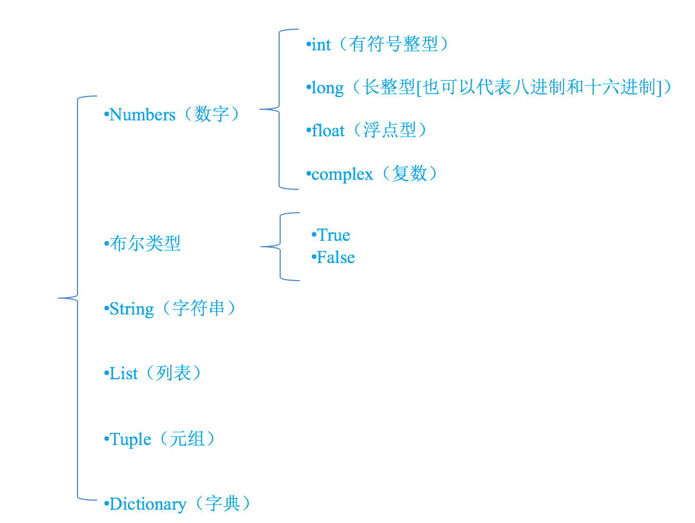
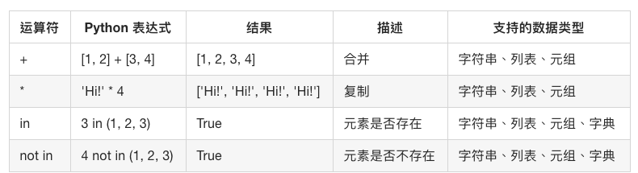
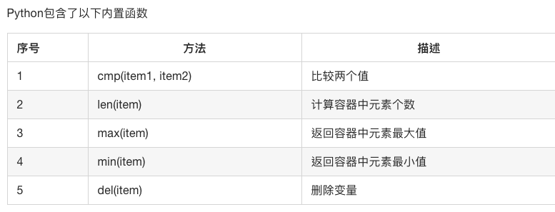

# python基础语法

## 一.Python基础知识
### 1 注释
```python
    #coding=utf-8
    print('你好')
```
### 2 变量以及类型
```python
    num1 = 100 #num1就是一个变量，就好一个小菜篮子
    num2 = 87  #num2也是一个变量
```

* 为了更充分的利用内存空间以及更有效率的管理内存，变量是有不同的类型的，如下所示:

+ 怎样知道一个变量的类型呢？
    + 在python中，只要定义了一个变量，而且它有数据，那么它的类型就已经确定了，不需要咱们开发者主动的去说明它的类型，系统会自动辨别
    + 可以使用type(变量的名字)，来查看变量的类型
    
### 3 [标识符和关键字](http://124.156.137.127/python/01-Python%E5%9F%BA%E7%A1%80/03day/section.5.html)

### 4 输入输出运算符
#### 输出
* 在程序中，看到了%这样的操作符，这就是Python中格式化输出。
```python
    age = 18
    name = "xiaohua"
    print("我的姓名是%s,年龄是%d"%(name,age))
```
下面是完整的，它可以与％符号使用列表:

| 格式符号 |	转换 |
| --- | --- |
|%c|	字符|
|%s	|通过str() 字符串转换来格式化|
|%i|	有符号十进制整数|
|%d|	有符号十进制整数|
|%u|	无符号十进制整数|
|%o|	八进制整数|
|%x|	十六进制整数（小写字母）|
|%X|	十六进制整数（大写字母）|
|%e|	索引符号（小写'e'）|
|%E|	索引符号（大写“E”）|
|%f|	浮点实数|
|%g|	％f和％e 的简写|
|%G|	％f和％E的简写|

#### 输入
```python
python3版本中
没有raw_input()函数，只有input()
并且 python3中的input与python2中的raw_input()功能一样
```

#### 运算符
```python
+ - * / 
//  取整除	返回商的整数部分 9//2 输出结果 4 , 9.0//2.0 输出结果 4.0
%	取余	返回除法的余数 b % a 输出结果 0
**	幂	返回x的y次幂 a**b 为10的20次方， 输出结果 100000000000000000000

赋值运算符
运算符	描述	实例
=	赋值运算符	把=号右边的结果给左边的变量 num=1+2*3 结果num的值为7
>>> a, b = 1, 2
>>> a
1
>>> b
2
复合赋值运算符
运算符	描述	实例
+=	加法赋值运算符	c += a 等效于 c = c + a
-=	减法赋值运算符	c -= a 等效于 c = c - a
*=	乘法赋值运算符	c *= a 等效于 c = c * a
/=	除法赋值运算符	c /= a 等效于 c = c / a
%=	取模赋值运算符	c %= a 等效于 c = c % a
**=	幂赋值运算符	c **= a 等效于 c = c ** a
//=	取整除赋值运算符	c //= a 等效于 c = c // a
```

### 5 数据类型转换
```python
常用的数据类型转换
函数	说明
int(x [,base ])	将x转换为一个整数
long(x [,base ])	将x转换为一个长整数
float(x )	将x转换到一个浮点数
complex(real [,imag ])	创建一个复数
str(x )	将对象 x 转换为字符串
repr(x )	将对象 x 转换为表达式字符串
eval(str )	用来计算在字符串中的有效Python表达式,并返回一个对象
tuple(s )	将序列 s 转换为一个元组
list(s )	将序列 s 转换为一个列表
chr(x )	将一个整数转换为一个字符
unichr(x )	将一个整数转换为Unicode字符
ord(x )	将一个字符转换为它的整数值
hex(x )	将一个整数转换为一个十六进制字符串
oct(x )	将一个整数转换为一个八进制字符串
举例
    a = '100' # 此时a的类型是一个字符串，里面存放了100这3个字符
    b = int(a) # 此时b的类型是整型，里面存放的是数字100

    print("a=%d"%b)
```

### 6 if else 比较关系运算符
```python
python中的比较运算符如下表

运算符	描述	示例
==	检查两个操作数的值是否相等，如果是则条件变为真。	如a=3,b=3则（a == b) 为 true.
!=	检查两个操作数的值是否相等，如果值不相等，则条件变为真。	如a=1,b=3则(a != b) 为 true.
<>	检查两个操作数的值是否相等，如果值不相等，则条件变为真。	如a=1,b=3则(a <> b) 为 true。这个类似于 != 运算符
>	检查左操作数的值是否大于右操作数的值，如果是，则条件成立。	如a=7,b=3则(a > b) 为 true.
<	检查左操作数的值是否小于右操作数的值，如果是，则条件成立。	如a=7,b=3则(a < b) 为 false.
>=	检查左操作数的值是否大于或等于右操作数的值，如果是，则条件成立。	如a=3,b=3则(a >= b) 为 true.
<=	检查左操作数的值是否小于或等于右操作数的值，如果是，则条件成立。	如a=3,b=3则(a <= b) 为 true.
<2> 逻辑运算符
运算符	逻辑表达式	描述	实例
and	x and y	布尔"与" - 如果 x 为 False，x and y 返回 False，否则它返回 y 的计算值。	(a and b) 返回 20。
or	x or y	布尔"或" - 如果 x 是 True，它返回 True，否则它返回 y 的计算值。	(a or b) 返回 10。
not	not x	布尔"非" - 如果 x 为 True，返回 False 。如果 x 为 False，它返回 True。	not(a and b) 返回 False
```

## 二.判断语句和循环语句
### if else for while break continue
```
if往往用来对条件是否满足进行判断
if有4中基本的使用方法：

基本方法
    if 条件:
        满足时做的事情
满足与否执行不同的事情
    if 条件:
        满足时做的事情
    else:
        不满足时做的事情
多个条件的判断

    if 条件:
        满足时做的事情
    elif 条件2:
        满足条件2时做的事情
    elif 条件3:
        满足条件3时做的事情
    else:
        条件都不满足时做的事情
嵌套

    if 条件:
        满足时做的事情

        这里还可以放入其他任何形式的if判断语句
while循环一般通过数值是否满足来确定循环的条件

      i = 0
      while i<10:
          print("hello")
          i+=1
for循环一般是对能保存多个数据的变量，进行便利

      name = 'dongGe'

      for x in name:
          print(x)
if、while、for等其他语句可以随意组合，这样往往就完成了复杂的功能

break 结束循环体 
continue 跳出本次循环继续之后的循环
```

### 三. 字符串、列表、元组、字典
#### 1 字符串
```python
切片
切片是指对操作的对象截取其中一部分的操作。字符串、列表、元组都支持切片操作。
切片的语法：[起始:结束:步长]
注意：选取的区间属于左闭右开型，即从"起始"位开始，到"结束"位的前一位结束（不包含结束位本身)。
我们以字符串为例讲解。
如果取出一部分，则可以在中括号[]中，使用:
name = 'abcdef'
print(name[0:3]) # 取 下标0~2 的字符

print(name[1:-1]) # 取 下标为1开始 到 最后第2个  之间的字符
运行结果: 

 >>> a = "abcdef"
 >>> a[:3]
 'abc'
 >>> a[::2]
 'ace'
 >>> a[5:1:2] 
 ''
 >>> a[1:5:2]
 'bd'
 >>> a[::-2]
 'fdb' 
 >>> a[5:1:-2]
 'fd'
```
#### 2 数组-列表
```python
变量A的类型为列表

    namesList = ['xiaoWang','xiaoZhang','xiaoHua']
比C语言的数组强大的地方在于列表中的元素可以是不同类型的

    testList = [1, 'a']
 namesList = ['xiaoWang','xiaoZhang','xiaoHua']
    print(namesList[0])
    print(namesList[1])
    print(namesList[2])
```

```python
1. 使用for循环
为了更有效率的输出列表的每个数据，可以使用循环来完成
demo:
    namesList = ['xiaoWang','xiaoZhang','xiaoHua']
    for name in namesList:
        print(name)
结果:
    xiaoWang
    xiaoZhang
    xiaoHua
2. 使用while循环
为了更有效率的输出列表的每个数据，可以使用循环来完成

demo:
    namesList = ['xiaoWang','xiaoZhang','xiaoHua']
    length = len(namesList)
    i = 0
    while i<length:
        print(namesList[i])
        i+=1
```
#### 3 元组与字典
- 列表的相关`操作`
- 列表中存放的数据是可以进行修改的，比如"增"、"删"、"改""
- <1>添加元素(**"增"append, extend, insert**)

append
通过append可以向列表添加元素
extend
通过extend可以将另一个集合中的元素逐一添加到列表中
insert
insert(index, object) 在指定位置index前插入元素object
```python
    namesList = [1, 23, 232]
    namesList.append(name)
    namesList.insert(1, 2)
    b = [1, 23]
    namesList.extend(b)
```

##### <2>修改元素("改")
修改元素的时候，要通过下标来确定要修改的是哪个元素，然后才能进行修改
* A = ['xiaoWang','xiaoZhang','xiaoHua']
* A[1] = 'xiaoLu'

##### <3>查找元素("查"in, not in, index, count)
###### in, not in
python中查找的常用方法为：

* in（存在）,如果存在那么结果为true，否则为false
* not in（不存在），如果不存在那么结果为true，否则false
```python
   #查找是否存在
    if "123" in namesList:
        print("找到了相同的字符串")
    else:
        print("没有找到相同的字符串")

    if "123" not in namesList:
        print("--这个字符串不存在")
    else:
        print("--这个字符串存在")
    
```
##### <3>index, count
```python
    a = ['a', 'b', 'c', 'a', 'b']
    # a.index('a', 1, 3)  # 注意是左闭右开区间
    print(a.count('b'))
    print(a.index('a', 1, 4))
```
##### <4>删除元素("删"del, pop, remove)
列表元素的常用删除方法有：
* del：根据下标进行删除
* pop：删除最后一个元素
* remove：根据元素的值进行删除

```python
    del a[1] #删除指定位置
    print(a)

    a.pop() #删除最后一个
    print(a)

    a.remove('a') #删除指定值
    print(a)
```

##### <5>排序(sort, reverse)
```python
    # 排序 sort reverse
    a.reverse() #逆序
    print(a)
    
    a.sort(reverse=True) #正序
    print(a)
```

### 4 列表的嵌套
```python
    1.嵌套示例
    schoolNames = [['北京大学','清华大学'],
                    ['南开大学','天津大学','天津师范大学'],
                    ['山东大学','中国海洋大学']]
    2.应用
    一个学校，有3个办公室，现在有8位老师等待工位的分配，请编写程序，完成随机的分配
    #encoding=utf-8
    import random
    # 定义一个列表用来保存3个办公室
    offices = [[],[],[]]
    # 定义一个列表用来存储8位老师的名字
    names = ['A','B','C','D','E','F','G','H']
    i = 0
    for name in names:
        index = random.randint(0,2)    
        offices[index].append(name)
    i = 1
    for tempNames in offices:
        print('办公室%d的人数为:%d'%(i,len(tempNames)))
```

### 5 元组
```python
# 元组与数组相似，不同之处在于元祖元素不能修改
aTuple = ('ep', 77, 99, 9)
print(aTuple)
print(aTuple[1])
```

### 6 字典
* 字典和列表一样，也能够存储多个数据
* 列表中找某个元素时，是根据下标进行的
* 字典的每个元素由2部分组成，键:值。例如 'name':'班长' ,'name'为键，'班长'为值

```python
info = {'test':'banzhang', 'id': 10}
print(info)
print(info['test'])
info.get('test')
info('s') #不存在键报错
## 字典的常见操作
print(len(info))  #字典长度
print(info.values()) #字典values
print(info.items()) #返回字典元组列表
# print(info.has_key('test')) #如果key存在，返回ture python2.0
## 字典遍历
for value in info:
    print(value)
#遍历字典key
for key in info.keys(): #遍历key
    print(key)
for value in info.values(): #遍历值
    print(value)
for item in info.items():   #遍历元组元素
    print(item)
for key,value in info.items():  #遍历键值对
    print(key,value)
```
### 7 运算符

#### python内置函数


#### 8 引用
* 在python中，值是靠引用来传递来的。
* 我们可以用id()来判断两个变量是否为同一个值的引用。 我们可以将id值理解为那块内存的地址标示。
a = 1
print(id(a))
print(id(info['test']))